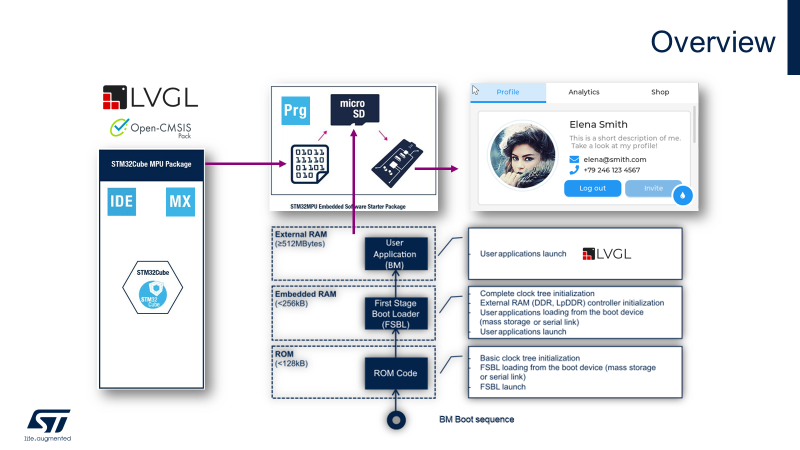
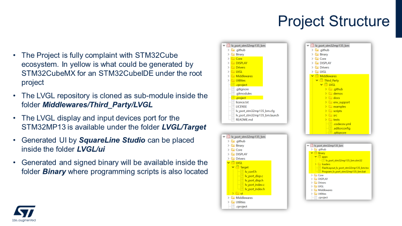
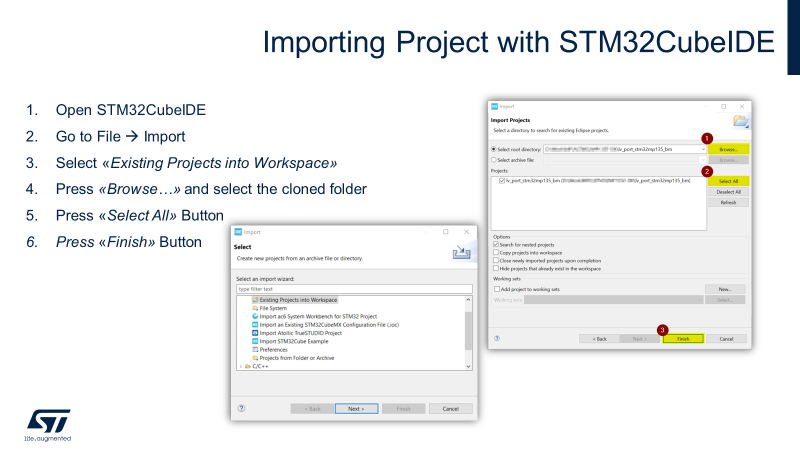
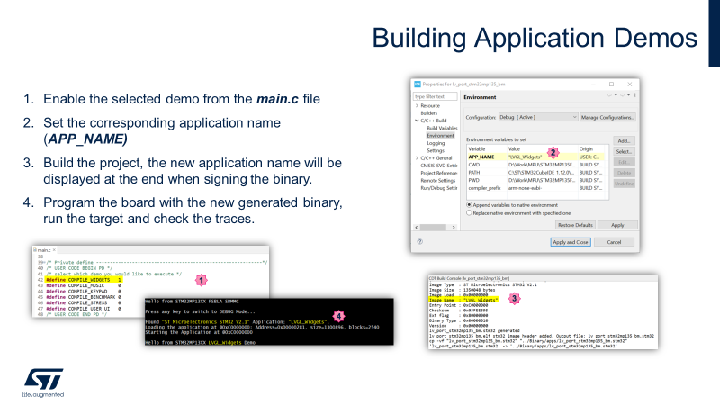
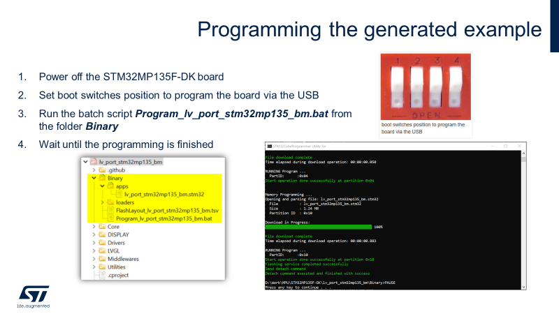
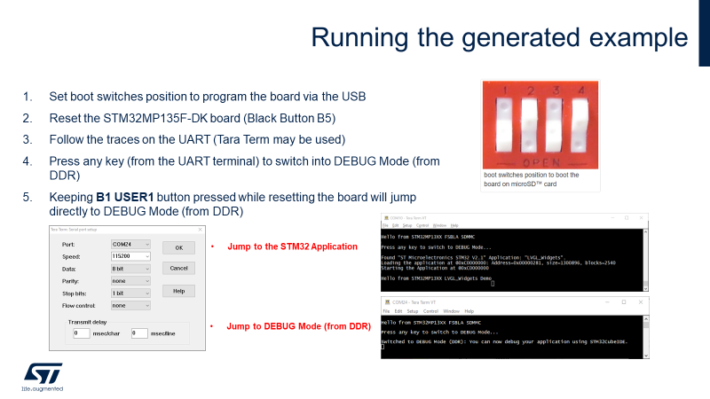
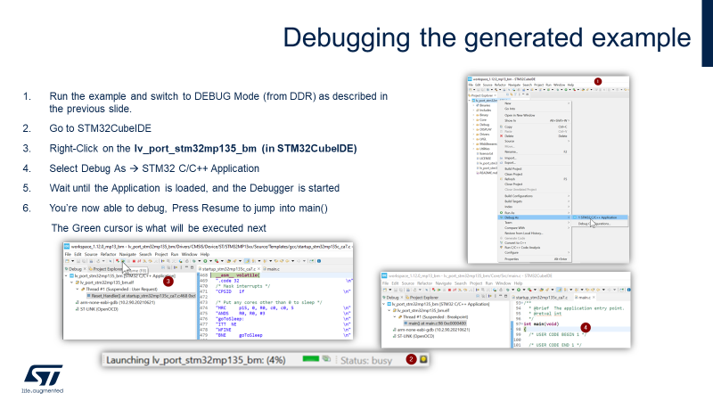

# LVGL ported to the STM32MP135F-DK Bare Metal

The [STM32MP135F-DK](https://www.st.com/en/evaluation-tools/stm32mp135f-dk.html) board is an affordable development board with:
* 4.3" 480×272 pixels LCD display module with capacitive touch panel and RGB interface
* STM32MP135FAF7 MPU with an Arm® Cortex®‑A7 32-bit processor at 1 GHz, in a TFBGA320 package
* 4-Gbit DDR3L, 16 bits, 533 MHz
* UXGA 2-megapixel CMOS camera module (included) with MIPI CSI-2® / SMIA CCP2 deserializer
* Wi‑Fi® 802.11b/g/n
* Bluetooth® Low Energy 4.1
* Dual 10/100 Mbit/s Ethernet (RMII) compliant with IEEE-802.3u, one with Wake on LAN (WoL) support
* USB Host 4-port hub
* USB Type-C® DRP based on an STM32G0 device
* On-board current measurement
* On-board STLINK-V3E debugger/programmer with USB re-enumeration capability: mass storage, Virtual COM port, and debug port
* Full mainline open-source Linux® STM32 MPU OpenSTLinux Distribution (such as STM32MP1Starter) software and examples
* Support of several Integrated Development Environments (IDEs) including [STM32CubeIDE](https://www.st.com/en/development-tools/stm32cubeide.html)
* [Bare metal support for RTOS (Eclipse ThreadX)](https://www.st.com/en/embedded-software/stm32cubemp13.html)

The project was created with STM32CubeIDE.

## Requirements
* [STM32CubeIDE](https://www.st.com/en/development-tools/stm32cubeide.html) installed.
* This project (configured for **STM32CubeIDE**)

## Overview


## Project Structure


## Usage

### Get the STM32CubeIDE project

Clone the STM32CubeIDE project and the related sub modules:

```
git clone --recursive https://github.com/PRG-MPU-CUST/lv_port_stm32mp135f_disco_bm.git
```

### Import the STM32CubeIDE project


### Building the Application Demos


### Programming the generated example


### Running the generated example


### Debugging the generated example

